# Thinking Review Expert - Architecture Documentation

## System Architecture Overview

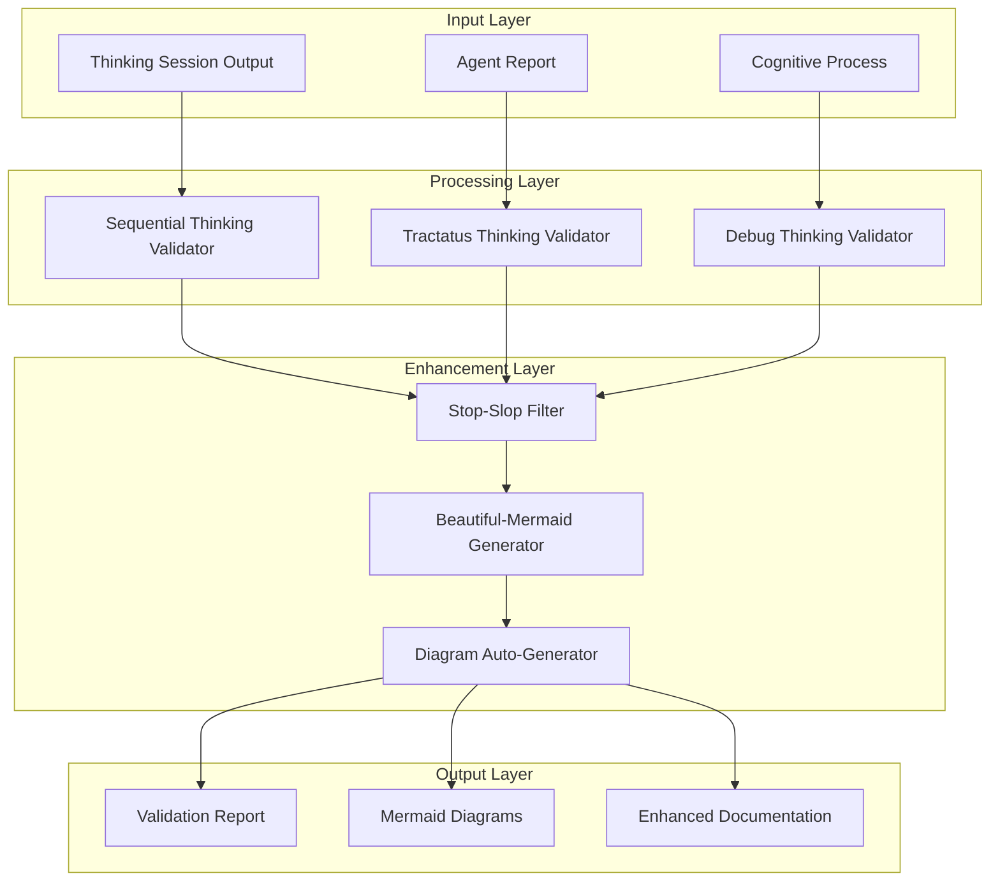

## Component Architecture

### 1. Core Validation Engine

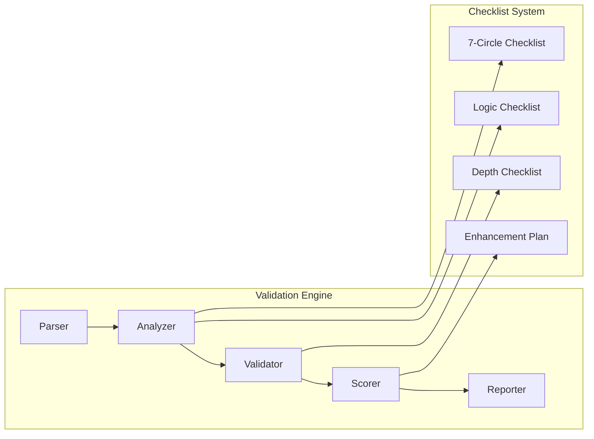

### 2. Embedded Tools Architecture

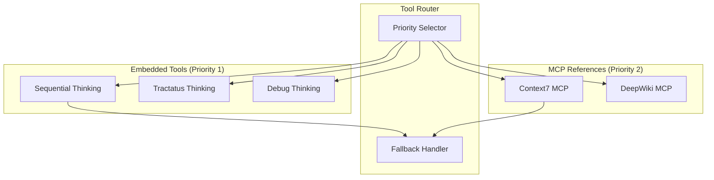

### 3. Auto-Diagram Generation System

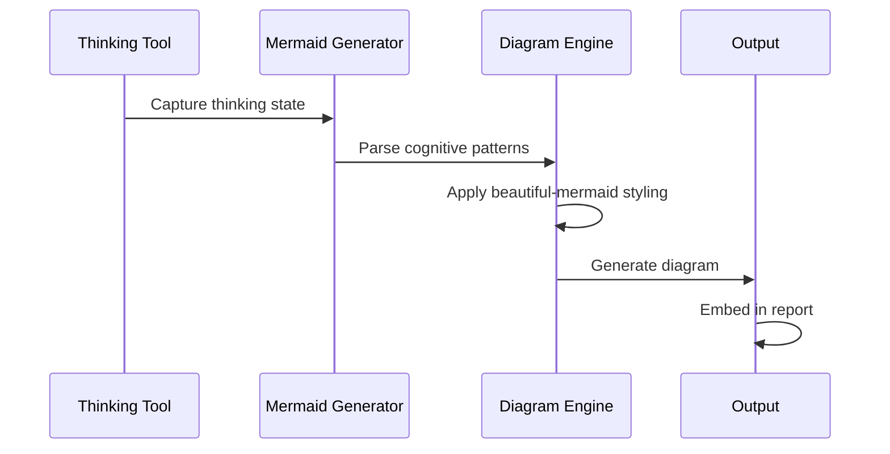

## Data Flow Architecture

### Input Processing Flow

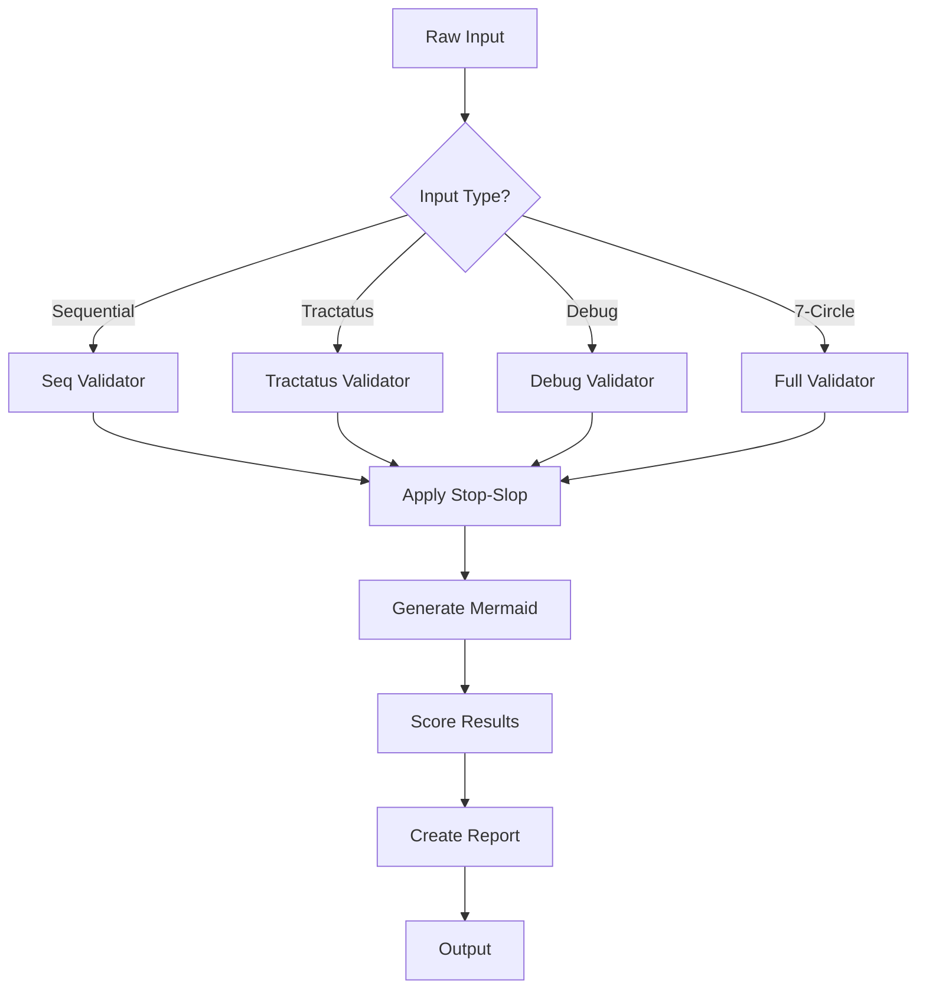

### Enhancement Pipeline

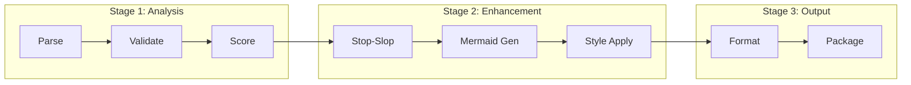

## File Structure

```
thinking-review-expert/
├── skill.md                    # Main skill entry point
├── package.json                # NPM package configuration
├── README.md                   # User documentation
├── ARCHITECTURE.md             # This file
├── LICENSE                     # MIT License
│
├── references/                 # Validation checklists
│   ├── 7circle-checklist.md
│   ├── logical-structure-checklist.md
│   ├── depth-quality-checklist.md
│   ├── enhancement-plan.md
│   ├── stop-slop.md
│   └── beautiful-mermaid.md
│
├── tools/                      # Embedded tool implementations
│   ├── embedded-sequential-thinking.md
│   ├── embedded-tractatus-thinking.md
│   ├── embedded-debug-thinking.md
│   ├── embedded-context7.md
│   ├── embedded-deepwiki.md
│   └── README.md
│
├── docs/                       # Additional documentation
│   ├── GITHUB_PAGES.md
│   └── CODE_REVIEW_ROADMAP.md
│
└── agents/                     # Agent configurations
    └── agent.yaml
```

## Integration Points

### Claude Code Integration

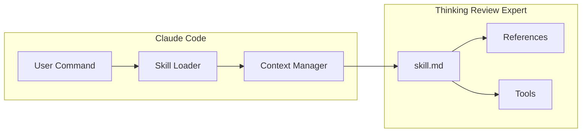

### MCP Server Integration

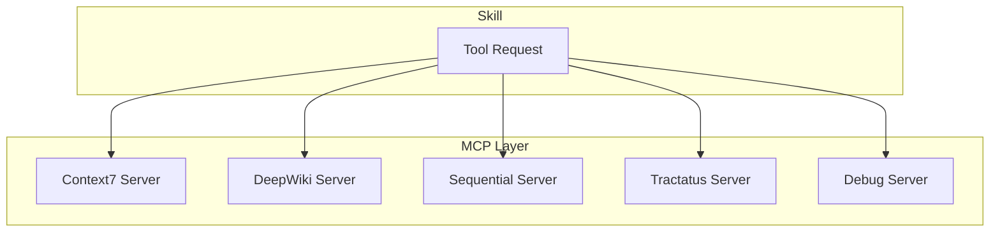

## Performance Optimization

### Token Saving Strategy

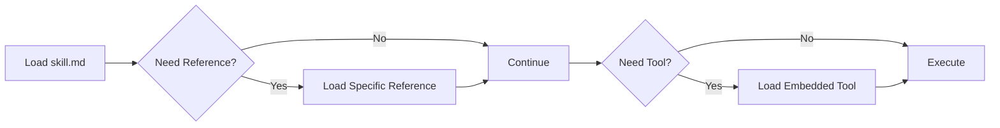

### Lazy Loading Architecture

1. **Base Load** (~100 tokens): skill.md metadata
2. **On-Demand References**: Load checklists only when needed
3. **Embedded Tools**: Load only when specific tool required
4. **MCP Fallback**: Use MCP servers only if embedded unavailable

## Extension Points

### Adding New Validators

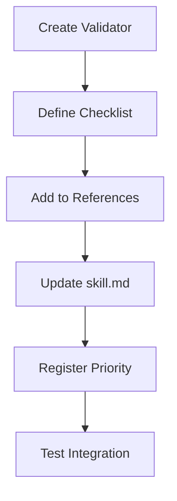

### Adding New Diagram Types

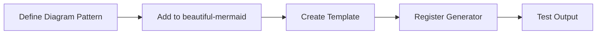

## Security Considerations

### Input Validation

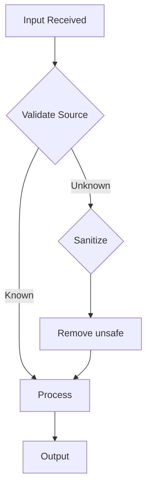

### Tool Execution Safety

1. **Sandboxed Execution**: All embedded tools run in isolation
2. **Resource Limits**: Timeout and memory constraints
3. **Fallback Handling**: Graceful degradation on errors
4. **Input Sanitization**: Clean all inputs before processing

## Quality Assurance

### Testing Strategy

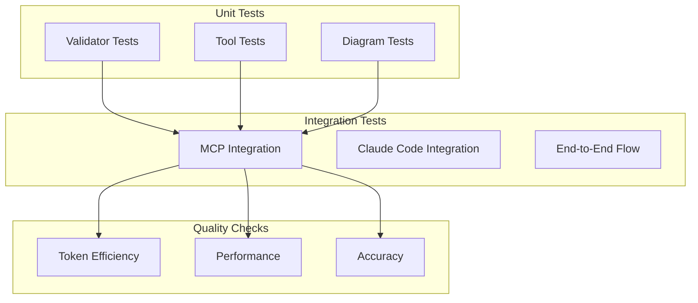

### Continuous Improvement

```mermaid
cycle-arrow
    A[Collect Metrics] --> B[Analyze Patterns]
    B --> C[Identify Issues]
    C --> D[Implement Fixes]
    D --> E[Test Changes]
    E --> A
```

---

**Version**: 6.0.0  
**Last Updated**: 2025-01-06  
**Maintainer**: Alot1z
