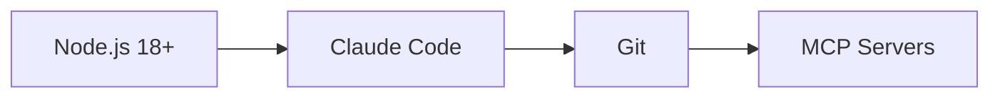
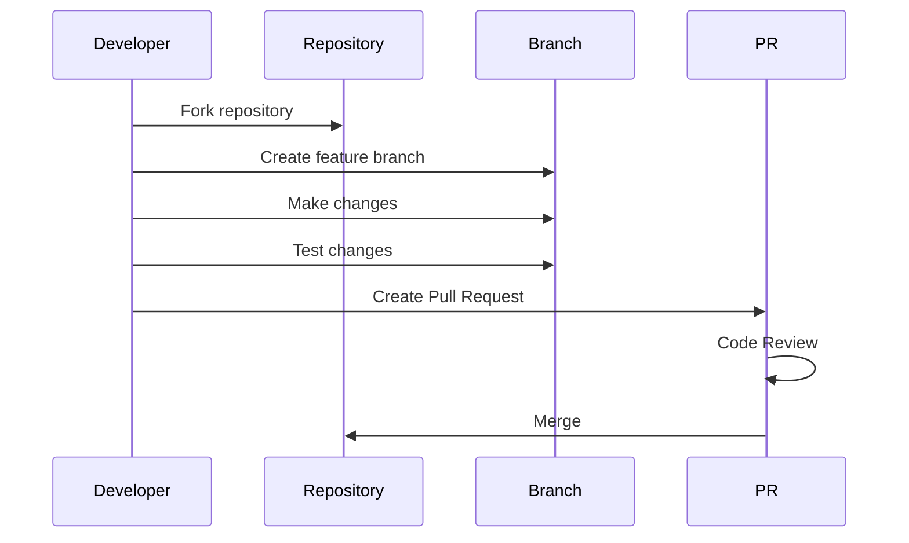
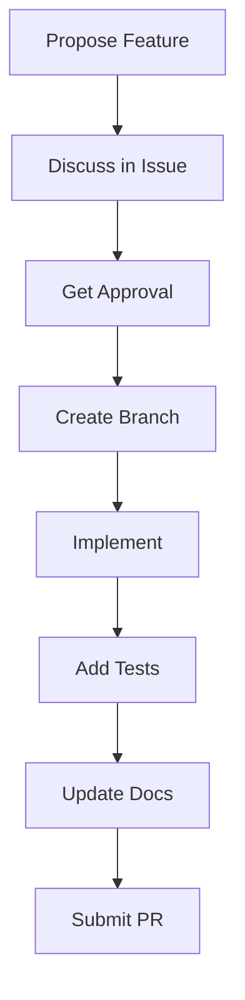
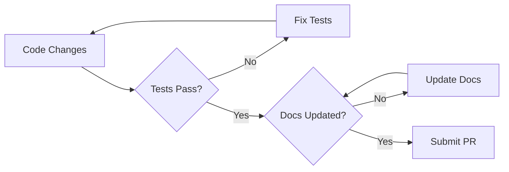
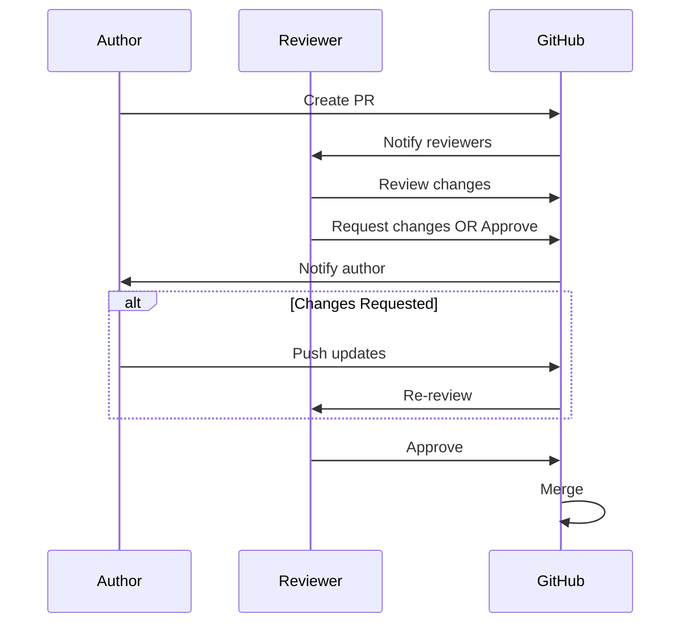

# Thinking Review Expert - Contributing Guide

Thank you for your interest in contributing to Thinking Review Expert! This guide will help you get started.

## Table of Contents

- [Code of Conduct](#code-of-conduct)
- [How to Contribute](#how-to-contribute)
- [Development Setup](#development-setup)
- [Project Structure](#project-structure)
- [Contributing Guidelines](#contributing-guidelines)
- [Pull Request Process](#pull-request-process)

## Code of Conduct

### Our Pledge

We pledge to make participation in our project a harassment-free experience for everyone, regardless of level of experience, gender, gender identity and expression, sexual orientation, disability, personal appearance, body size, race, ethnicity, age, religion, or nationality.

### Our Standards

**Positive Behavior:**
- Using welcoming and inclusive language
- Being respectful of differing viewpoints and experiences
- Gracefully accepting constructive criticism
- Focusing on what is best for the community
- Showing empathy towards other community members

**Unacceptable Behavior:**
- Harassment, trolling, or derogatory comments
- Personal or political attacks
- Public or private harassment
- Publishing others' private information
- Other unethical or unprofessional conduct

## How to Contribute

### Reporting Bugs

Before creating bug reports, please check existing issues to avoid duplicates.

**Bug Report Template:**

```markdown
### Description
Clear and concise description of the bug

### Steps to Reproduce
1. First step
2. Second step
3. ...

### Expected Behavior
What should happen

### Actual Behavior
What actually happens

### Environment
- OS: [e.g. Windows, macOS, Linux]
- Node Version: [e.g. 18.0.0]
- Skill Version: [e.g. 6.0.0]

### Additional Context
Screenshots, logs, or other relevant information
```

### Suggesting Enhancements

Enhancement suggestions are tracked as GitHub issues. When creating an enhancement suggestion, include:

- **Use a clear and descriptive title**
- **Provide a detailed description of the suggested enhancement**
- **Explain why this enhancement would be useful**
- **List some examples of how this feature would be used**
- **Include mockups or diagrams if applicable**

## Development Setup

### Prerequisites



### Installation

```bash
# Clone the repository
git clone https://github.com/Alot1z/thinking-review-expert.git
cd thinking-review-expert

# Install dependencies (if any)
npm install

# Link to Claude Code skills directory
npm run link
```

### Development Workflow



## Project Structure

```
thinking-review-expert/
├── skill.md                    # Main skill - ENTRY POINT
├── package.json                # NPM configuration
├── README.md                   # User documentation
├── ARCHITECTURE.md             # System architecture
├── CONTRIBUTING.md             # This file
│
├── references/                 # Validation checklists
│   ├── 7circle-checklist.md
│   ├── logical-structure-checklist.md
│   ├── depth-quality-checklist.md
│   ├── enhancement-plan.md
│   ├── stop-slop.md
│   └── beautiful-mermaid.md
│
├── tools/                      # Embedded tools
│   ├── embedded-sequential-thinking.md
│   ├── embedded-tractatus-thinking.md
│   ├── embedded-debug-thinking.md
│   ├── embedded-context7.md
│   ├── embedded-deepwiki.md
│   └── README.md
│
├── docs/                       # Additional docs
│   ├── GITHUB_PAGES.md
│   └── CODE_REVIEW_ROADMAP.md
│
└── agents/                     # Agent configs
    └── agent.yaml
```

## Contributing Guidelines

### Code Style

**Stop-Slop Principles:**
- Use direct, active language
- Avoid buzzwords and corporate speak
- Be specific and concrete
- Eliminate unnecessary words
- Write clearly and concisely

**Example:**

```markdown
❌ BAD: "We should utilize leverage synergies to facilitate..."

✅ GOOD: "Use this tool to check quality."
```

### Documentation Standards

All documentation should follow these principles:

1. **Clear Structure**: Use consistent heading hierarchy
2. **Visual Aids**: Include mermaid diagrams where helpful
3. **Examples**: Provide concrete usage examples
4. **Accuracy**: Keep information up-to-date
5. **Accessibility**: Use clear, simple language

### Adding New Features



**Feature Checklist:**

- [ ] Feature proposal discussed and approved
- [ ] Implementation follows architecture
- [ ] Code follows style guidelines
- [ ] Tests added (if applicable)
- [ ] Documentation updated
- [ ] Examples provided
- [ ] Backward compatibility maintained

### Adding New Validators

When adding a new validation checklist:

1. Create reference file in `references/`
2. Follow existing checklist format
3. Add to `skill.md` validation workflow
4. Update `ARCHITECTURE.md` if needed
5. Provide usage examples

**Template:**

```markdown
# [Name] Checklist

## Purpose
Brief description of what this validates

## Checks
- [ ] Check 1
- [ ] Check 2
- [ ] ...

## Usage
When to use this checklist

## Examples
Concrete examples
```

## Pull Request Process

### Before Submitting



### PR Title Format

Use conventional commit format:

```
type(scope): description

# Types:
# feat: New feature
# fix: Bug fix
# docs: Documentation changes
# style: Code style changes
# refactor: Code refactoring
# test: Test changes
# chore: Build process or auxiliary tool changes
```

### PR Description Template

```markdown
## Description
Brief description of changes

## Type of Change
- [ ] Bug fix
- [ ] New feature
- [ ] Breaking change
- [ ] Documentation update

## Related Issues
Fixes #issue_number

## Changes Made
- Change 1
- Change 2
- ...

## Testing
- [ ] Unit tests pass
- [ ] Integration tests pass
- [ ] Manual testing completed

## Screenshots/Diagrams
If applicable

## Checklist
- [ ] Code follows style guidelines
- [ ] Self-review completed
- [ ] Documentation updated
- [ ] No new warnings generated
- [ ] Tests added/updated
- [ ] All tests passing
```

### Review Process



## Release Process

### Versioning

We follow Semantic Versioning:

```
MAJOR.MINOR.PATCH

MAJOR: Incompatible API changes
MINOR: Backwards-compatible functionality additions
PATCH: Backwards-compatible bug fixes
```

### Release Checklist

- [ ] All tests passing
- [ ] Documentation updated
- [ ] CHANGELOG.md updated
- [ ] Version bumped in package.json
- [ ] Git tag created
- [ ] Release published to npm
- [ ] GitHub release created

## Getting Help

### Resources

- **Documentation**: Check README.md and ARCHITECTURE.md
- **Issues**: Search existing GitHub issues
- **Discussions**: Use GitHub Discussions for questions
- **Code of Conduct**: See above

### Contact

- **GitHub Issues**: https://github.com/Alot1z/thinking-review-expert/issues
- **GitHub Discussions**: https://github.com/Alot1z/thinking-review-expert/discussions

## Recognition

Contributors will be recognized in:

- CONTRIBUTORS.md file
- Release notes for significant contributions
- Project documentation for ongoing contributors

---

## License

By contributing, you agree that your contributions will be licensed under the MIT License.

---

**Thank you for contributing!** 🚀

**Version**: 6.0.0  
**Last Updated**: 2025-01-06  
**Maintainer**: Alot1z
