# Thinking Review Expert


<div align="center">

<h1>Thinking Review Expert</h1>

<p><strong>Automatic validation for 7-circle sacred thinking flows</strong></p>

</div>

---

<div align="center">

[](https://github.com/Alot1z/thinking-review-expert/wiki)
[](https://Alot1z.github.io/thinking-review-expert/)
[](https://www.npmjs.com/package/thinking-review-expert)
[](https://github.com/Alot1z/thinking-review-expert)

</div>

---

## Features

| Feature | Description |
|---------|-------------|
| **7-Circle Validation** | Complete validation across all sacred thinking circles |
| **3-Tool Integration** | Sequential + Tractatus + Debug working in harmony |
| **Quality Scoring** | 0-100 score with specific recommendations |
| **Stop-Slop** | Auto-applies direct, active language principles |
| **Token Savings** | 85-90% savings via lazy loading |
| **Auto-Diagrams** | Beautiful mermaid diagrams generated automatically |

## How the 3 Thinking Tools Work Together

```
┌─────────────────┐      ┌─────────────────┐      ┌─────────────────┐
│  Sequential     │──T→  │  Tractatus      │──S→  │  Debug          │
│  Thinking       │      │  Thinking       │      │  Thinking       │
│                 │      │                 │      │                 │
│  Step-by-step   │      │  Logical        │      │  Problem        │
│  progression    │      │  structure      │      │  tracking       │
└─────────────────┘      └─────────────────┘      └─────────────────┘
         │                         │                        │
         └─────────────────────────┴────────────────────────┘
                                   │
                          7-CIRCLE SACRED
                         THINKING VALIDATION
```

**Tool Rotation (All 7 Circles)**: Sequential → Tractatus → Debug

| Circle | Sequential | Tractatus | Debug |
|--------|-----------|-----------|-------|
| 1 Vision | Intent extraction | Logical structure | Problem definition |
| 2 Research | Information gathering | Concept analysis | Research tracking |
| 3 Structure | Task breakdown | Architecture | Structure issues |
| 4 Design | Solution planning | Design logic | Design bugs |
| 5 Build | Implementation | Build structure | Build problems |
| 6 Validate | Verification | Validation logic | Test tracking |
| 7 Integrate | Integration | System unity | Final issues |

**Why This Works**: Each tool provides unique cognitive capabilities that complement each other, creating comprehensive thinking coverage.

---

## Installation

### NPM (Recommended - Primary Installation Method)

```bash
# Global installation (recommended)
npm install -g thinking-review-expert

# Or as dev dependency
npm install --save-dev thinking-review-expert
```

### Claude Code / Claude Skills (Alternative)

```bash
# Clone directly to skills directory
git clone https://github.com/Alot1z/thinking-review-expert.git ~/.claude/skills/thinking-review-expert

# Or clone and copy
git clone https://github.com/Alot1z/thinking-review-expert.git
cp -r thinking-review-expert ~/.claude/skills/
```

---

## Future Plans

### Auto-Integration with Code-Review-Expert
- **Automatic code review**: Every validated thinking session triggers comprehensive code review
- **SOLID principles validation**: Check code quality against best practices
- **Security scanning**: Auto-detect vulnerabilities in generated code
- **Performance analysis**: Identify optimization opportunities

### Hooks Integration
Planned hooks for automatic triggering:
- `post-thinking-hook`: Auto-validate after any thinking tool completes
- `pre-commit-hook`: Validate thinking quality before git commits
- `post-merge-hook`: Review thinking patterns after PR merges
- `ci-integration`: Quality gates in CI/CD pipelines

### Token Optimization
- **Smart compression**: Identify redundant thinking patterns
- **Lazy loading enhancements**: Load only what's needed, when needed
- **Context optimization**: Minimize token usage while maintaining quality
- **Caching strategies**: Cache validation results for reuse

---

## What It Does

This skill automatically activates when you use thinking tools and provides comprehensive validation:

```mermaid
flowchart TD
    A[You use thinking tool] --> B{Tool Type?}
    B -->|Sequential| C[Sequential Thinking]
    B -->|Tractatus| D[Tractatus Thinking]
    B -->|Debug| E[Debug Thinking]
    
    C --> F[Skill detects usage]
    D --> F
    E --> F
    
    F --> G[Validate 7-circle compliance]
    G --> H[Apply stop-slop principles]
    H --> I[Generate quality report]
    I --> J[Score: 0-100]
    
    J --> K{Score ≥ 80?}
    K -->|Yes| L[PASS]
    K -->|No| M[Recommendations provided]
    
    style A fill:#1e3a5f
    style F fill:#2d4a6f
    style G fill:#3d5a7f
    style H fill:#4d6a8f
    style I fill:#5d7a9f
    style L fill:#4a7c59
    style M fill:#8b4a4a
```



---

## 7-Circle Validation with Tool Rotation

The 7-circle sacred thinking uses a **consistent T→S→D rotation pattern**:

### Tool Rotation (T→S→D)

**Every Circle**: Sequential (T) → Tractatus (S) → Debug (D)

This provides consistent cognitive enhancement across all 7 circles.
```

**Tool Rotation (T→S→D):**
- **Every Circle**: Sequential (T) → Tractatus (S) → Debug (D)
- This provides consistent cognitive enhancement across all 7 circles

---

## Quick Start

### Sequential Thinking

```typescript
sequentialthinking(
  thought="Analyze system bottlenecks",
  thoughtNumber=1,
  totalThoughts=5,
  nextThoughtNeeded=true
)
```

### Tractatus Thinking

```typescript
tractatusthinking(
  operation="start",
  concept="What is token optimization?",
  depth_limit=3
)
```

### Debug Thinking

```typescript
debug_thinking(
  action="create",
  nodeType="problem",
  content="Agent spawning fails with complex prompts"
)
```

---

## Stop-Slop Writing

**Before (AI Slop):**
> "I was wondering if perhaps you might want to consider potentially exploring the possibility of enhancing the depth of your analysis..."

**After (Stop-Slop):**
> "Add 2 more thought cycles. Include alternative perspectives."

**Principles:**
- Direct language (no hedging)
- Active voice (no passive)
- Specific terms (no vague modifiers)
- No buzzwords (no corporate speak)

---

## Embedded Tools

```mermaid
graph TB
    Root[Thinking Review Expert] --> Sequential[Sequential Thinking<br/>203 lines]
    Root --> Tractatus[Tractatus Thinking<br/>353 lines]
    Root --> Debug[Debug Thinking<br/>388 lines]
    
    Sequential --> S1[6 Specialized Agents]
    Sequential --> S2[Adaptive Routing]
    Sequential --> S3[Branching Support]
    
    Tractatus --> T1[8 Operations]
    Tractatus --> T2[Proposition Trees]
    Tractatus --> T3[Logical Decomposition]
    
    Debug --> D1[Graph Tracking]
    Debug --> D2[6 Node Types]
    Debug --> D3[8 Edge Types]
    
    style Root fill:#2d4a6f
    style Sequential fill:#3d6b4e
    style Tractatus fill:#6b4a4a
    style Debug fill:#6b5f3a
```



**Total:** 944 lines of embedded implementations

---

## Configuration

```bash
# Enable auto-diagram generation (default: true)
THINKING_REVIEW_AUTO_DIAGRAMS=true

# Mermaid theme (default: zinc-dark)
THINKING_REVIEW_MERMAID_THEME=zinc-dark

# Stop-slop enforcement (default: true)
THINKING_REVIEW_STOP_SLOP=true
```

---

## Performance

| Operation | Tokens | Time | Quality |
|-----------|--------|------|--------|
| Sequential (1 thought) | 300-1500 | ~1s | High |
| Tractatus (1 operation) | 200-1000 | ~1s | High |
| Debug (1 node) | 100-500 | ~1s | High |
| Full validation | 500-1500 | ~5s | Comprehensive |

**Token Savings:** 85-90% with lazy loading

---

## Related Skills & Resources

### Core Thinking MCP Servers

| Server | Description | Source |
|--------|-------------|--------|
| **sequential-thinking** | Step-by-step reasoning | [gitlab.com/CochainComplex/tractatus-thinking](https://gitlab.com/CochainComplex/tractatus-thinking) |
| **tractatus-thinking** | Logical concept analysis | [gitlab.com/CochainComplex/tractatus-thinking](https://gitlab.com/CochainComplex/tractatus-thinking) |
| **debug-thinking** | Graph-based problem tracking | [lobehub.com/mcp/tosssssy-mcp-server-debug-thinking](https://lobehub.com/mcp/tosssssy-mcp-server-debug-thinking) |
| **@modelcontextprotocol/server-sequential-thinking** | Official MCP Sequential Thinking | [npmjs.com/package/@modelcontextprotocol/server-sequential-thinking](https://www.npmjs.com/package/@modelcontextprotocol/server-sequential-thinking) |
| **context7** | Documentation retrieval | [github.com/upstash/context7](https://github.com/upstash/context7) |
| **deepwiki** | GitHub repository research | [docs.devin.ai/work-with-devin/deepwiki](https://docs.devin.ai/work-with-devin/deepwiki) |

### Enhancement Skills

| Skill | Description | Link |
|-------|-------------|------|
| **code-review-expert** | Expert code review | [github.com/sanyuan0704/code-review-expert](https://github.com/sanyuan0704/code-review-expert) |
| **deslop** | Remove AI-generated slop | [npm](https://www.npmjs.com/package/deslop) |
| **stop-slop** | Direct language principles | [github.com/hardikpandya/stop-slop](https://github.com/hardikpandya/stop-slop) |
| **beautiful-mermaid** | 15 stunning themes | [github.com/lukilabs/beautiful-mermaid](https://github.com/lukilabs/beautiful-mermaid) |

### 7-Circle Sacred Skills

| Skill | Description | Link |
|-------|-------------|------|
| **7-scared-circle-enhanced** | 9-cycle quantum enhancement | [npm](https://www.npmjs.com/package/7-scared-circle-enhanced) |
| **7-scared-circle-deep** | 12-cycle deep analysis | [npm](https://www.npmjs.com/package/7-scared-circle-deep) |
| **7-scared-circle-clarity** | Maximum clarity, minimal questions | [npm](https://www.npmjs.com/package/7-scared-circle-clarity) |
| **7-scared-circle-rapid** | 5-cycle quick decisions | [npm](https://www.npmjs.com/package/7-scared-circle-rapid) |

### Documentation

- **GitHub Pages:** [Alot1z.github.io/thinking-review-expert](https://Alot1z.github.io/thinking-review-expert/)
- **Wiki:** [github.com/Alot1z/thinking-review-expert/wiki](https://github.com/Alot1z/thinking-review-expert/wiki)
- **7-BMAD Methodology:** [github.com/Alot1z/7-circle-bmad](https://github.com/Alot1z/7-circle-bmad)
- **Claude Code Skills:** [docs.anthropic.com/claude-code/skills](https://docs.anthropic.com/claude-code/skills)

---

## Contributing

Contributions are welcome! Please read our [contributing guidelines](CONTRIBUTING.md).

---

## License

MIT License - see [LICENSE](LICENSE) file for details

---

<div align="center">

**Version:** 6.0.1  
**Author:** Alot1z  
**License:** MIT  

[GitHub](https://github.com/Alot1z/thinking-review-expert) • 
[NPM](https://www.npmjs.com/package/thinking-review-expert) • 
[GitHub Pages](https://Alot1z.github.io/thinking-review-expert/) • 
[Wiki](https://github.com/Alot1z/thinking-review-expert/wiki)

</div>
