# Thinking Review Expert


<div align="center">

# 🧠 Thinking Review Expert

**Automatic validation for 7-circle sacred thinking flows**

</div>

---

<div align="center">

[](https://github.com/Alot1z/thinking-review-expert/wiki)
[](https://www.npmjs.com/package/thinking-review-expert)
[](https://github.com/Alot1z/thinking-review-expert)

</div>

---

## ✨ Features

| Feature | Description |
|---------|-------------|
| **7-Circle Validation** | Complete validation across all sacred thinking circles |
| **Embedded Tools** | Sequential (203 lines), Tractatus (353 lines), Debug (388 lines) |
| **Quality Scoring** | 0-100 score with specific recommendations |
| **Stop-Slop** | Auto-applies direct, active language principles |
| **Token Savings** | 85-90% savings via lazy loading |
| **Auto-Diagrams** | Beautiful mermaid diagrams generated automatically |

---

## 📦 Installation

```bash
# Claude Code / Claude Skills
git clone https://github.com/Alot1z/thinking-review-expert.git
cp -r thinking-review-expert ~/.claude/skills/

# NPM
npm install -g thinking-review-expert
# or
npm install --save-dev thinking-review-expert
```

---

## 🎯 What It Does

This skill automatically activates when you use thinking tools and provides comprehensive validation:


---

## 🔄 7-Circle Validation with Tool Rotation

The 7-circle sacred thinking uses a **consistent T→S→D rotation pattern**:

```mermaid
flowchart LR
    C1[Circle 1<br/>Vision<br/>T→S→D] --> C2[Circle 2<br/>Research<br/>T→S→D]
    C2 --> C3[Circle 3<br/>Structure<br/>T→S→D]
    C3 --> C4[Circle 4<br/>Design<br/>T→S→D]
    C4 --> C5[Circle 5<br/>Build<br/>T→S→D]
    C5 --> C6[Circle 6<br/>Validate<br/>T→S→D]
    C6 --> C7[Circle 7<br/>Integrate<br/>T→S→D]
    
    style C1 fill:#E1F5FF
    style C2 fill:#FFF3E0
    style C3 fill:#F3E5F5
    style C4 fill:#E8F5E8
    style C5 fill:#E0F2F1
    style C6 fill:#F1F8E9
    style C7 fill:#F8EFFF
```



**Tool Rotation (T→S→D):**
- **Every Circle**: Sequential (T) → Tractatus (S) → Debug (D)
- This provides consistent cognitive enhancement across all 7 circles

---

## 📖 Quick Start

### Sequential Thinking

```typescript
sequentialthinking(
  thought="Analyze system bottlenecks",
  thoughtNumber=1,
  totalThoughts=5,
  nextThoughtNeeded=true
)
```

### Tractatus Thinking

```typescript
tractatusthinking(
  operation="start",
  concept="What is token optimization?",
  depth_limit=3
)
```

### Debug Thinking

```typescript
debug_thinking(
  action="create",
  nodeType="problem",
  content="Agent spawning fails with complex prompts"
)
```

---

## ✍️ Stop-Slop Writing

**Before (AI Slop):**
> "I was wondering if perhaps you might want to consider potentially exploring the possibility of enhancing the depth of your analysis..."

**After (Stop-Slop):**
> "Add 2 more thought cycles. Include alternative perspectives."

**Principles:**
- ✅ Direct language (no hedging)
- ✅ Active voice (no passive)
- ✅ Specific terms (no vague modifiers)
- ✅ No buzzwords (no corporate speak)

---

## 📊 Embedded Tools


**Total:** 944 lines of embedded implementations

---

## 🔧 Configuration

```bash
# Enable auto-diagram generation (default: true)
THINKING_REVIEW_AUTO_DIAGRAMS=true

# Mermaid theme (default: zinc-dark)
THINKING_REVIEW_MERMAID_THEME=zinc-dark

# Stop-slop enforcement (default: true)
THINKING_REVIEW_STOP_SLOP=true
```

---

## 📈 Performance

| Operation | Tokens | Time | Quality |
|-----------|--------|------|--------|
| Sequential (1 thought) | 300-1500 | ~1s | High |
| Tractatus (1 operation) | 200-1000 | ~1s | High |
| Debug (1 node) | 100-500 | ~1s | High |
| Full validation | 500-1500 | ~5s | Comprehensive |

**Token Savings:** 85-90% with lazy loading

---

## 🔗 Related Skills & Resources

### Core Thinking MCP Servers

| Server | Description | GitHub |
|--------|-------------|--------|
| **sequential-thinking** | Step-by-step reasoning | [github.com/anthropics/sequential-thinking-mcp](https://github.com/anthropics/sequential-thinking-mcp) |
| **tractatus-thinking** | Logical concept analysis | [github.com/brundonsmith/tractatus-thinking-mcp](https://github.com/brundonsmith/tractatus-thinking-mcp) |
| **debug-thinking** | Graph-based problem tracking | [github.com/anthropics/debug-thinking-mcp](https://github.com/anthropics/debug-thinking-mcp) |
| **context7** | Documentation retrieval | [github.com/sudonymister/context7](https://github.com/sudonymister/context7) |
| **deepwiki** | GitHub repository research | [github.com/julep-ai/deepwiki](https://github.com/julep-ai/deepwiki) |

### Enhancement Skills

| Skill | Description | Link |
|-------|-------------|------|
| **code-review-expert** | Expert code review | [npm](https://www.npmjs.com/package/code-review-expert) |
| **deslop** | Remove AI-generated slop | [npm](https://www.npmjs.com/package/deslop) |
| **stop-slop** | Direct language principles | [Embedded](./references/stop-slop.md) |
| **beautiful-mermaid** | 15 stunning themes | [Embedded](./references/beautiful-mermaid.md) |

### 7-Circle Sacred Skills

| Skill | Description | Link |
|-------|-------------|------|
| **7-scared-circle-enhanced** | 9-cycle quantum enhancement | [npm](https://www.npmjs.com/package/7-scared-circle-enhanced) |
| **7-scared-circle-deep** | 12-cycle deep analysis | [npm](https://www.npmjs.com/package/7-scared-circle-deep) |
| **7-scared-circle-clarity** | Maximum clarity, minimal questions | [npm](https://www.npmjs.com/package/7-scared-circle-clarity) |
| **7-scared-circle-rapid** | 5-cycle quick decisions | [npm](https://www.npmjs.com/package/7-scared-circle-rapid) |

### Documentation

- **7-BMAD Methodology**: [github.com/Alot1z/7-circle-bmad](https://github.com/Alot1z/7-circle-bmad)
- **Claude Code Skills**: [docs.anthropic.com/claude-code/skills](https://docs.anthropic.com/claude-code/skills)

---

## 🤝 Contributing

Contributions are welcome! Please read our [contributing guidelines](CONTRIBUTING.md).

---

## 📄 License

MIT License - see [LICENSE](LICENSE) file for details

---

<div align="center">

**Version:** 6.0.1  
**Author:** Alot1z  
**License:** MIT  

[GitHub](https://github.com/Alot1z/thinking-review-expert) • 
[NPM](https://www.npmjs.com/package/thinking-review-expert) • 
[Wiki](https://github.com/Alot1z/thinking-review-expert/wiki)

</div>
