# Thinking Review Expert

<div align="center">


**7-Circle Sacred Thinking Validation with Embedded Tools**

*Auto-generated mermaid diagrams • Stop-slop principles • 85-90% token savings*

</div>

---

## 🚀 Quick Overview

**Thinking Review Expert** provides automatic validation for 7-circle sacred thinking flows with fully embedded tool implementations. It reviews sequential, tractatus, and debug thinking sessions for quality, completeness, and logical coherence while auto-generating beautiful mermaid diagrams for visualization.

### ✨ Key Features

- 🔧 **Embedded Thinking Tools** - Sequential (6-agent), Tractatus (8-operations), Debug (graph tracking)
- 📊 **Auto-Generated Diagrams** - Beautiful mermaid diagrams created automatically during thinking
- ✍️ **Stop-Slop Integration** - Anti-slop writing principles auto-applied to all outputs
- 🎯 **7-Circle Validation** - Complete validation across all 7 circles of sacred thinking
- 📦 **85-90% Token Savings** - Lazy loading architecture for maximum efficiency
- 🔗 **MCP References** - Context7 & DeepWiki available via external MCP servers
- 🤖 **Claude Code Compatible** - Follows code-review-expert format for seamless integration

---

## 🎯 What It Does

### Automatic Detection & Validation

The skill automatically detects when you use thinking tools and validates your session:

```mermaid
flowchart TD
    A[User invokes thinking tool] --> B{Tool Type?}
    B -->|Sequential| C[Sequential Thinking]
    B -->|Tractatus| D[Tractatus Thinking]
    B -->|Debug| E[Debug Thinking]
    
    C --> F[Load Embedded Implementation]
    D --> F
    E --> F
    
    F --> G[Validate 7-Circle Compliance]
    G --> H[Auto-Generate Mermaid Diagram]
    H --> I[Apply Stop-Slop Principles]
    I --> J[Generate Validation Report]
    
    J --> K[Quality Score: 0-100]
    K --> L{Score ≥ 80?}
    L -->|Yes| M[✅ PASS - Continue]
    L -->|No| N[❌ FAIL - Recommendations]
```



### Embedded Tools (3 Thinking Tools Fully Implemented)

| Tool | Description | Features | Lines |
|------|-------------|----------|-------|
| **Sequential Thinking** | Multi-agent reasoning | 6 specialized agents with adaptive routing | 203 |
| **Tractatus Thinking** | Logical concept analysis | 8 operations with proposition trees | 353 |
| **Debug Thinking** | Problem tracking | Graph-based system with 6 nodes, 8 edges | 388 |

**Total:** 944 lines of embedded implementations

---

## 📊 Architecture Diagram


---

## 🔄 Workflow Process

### 1. Detection Phase


### 2. 7-Circle Validation Flow

```mermaid
flowchart LR
    subgraph "7-Circle Sacred Thinking"
        C1[Circle 1: Vision<br/>Purpose & Goals]
        C2[Circle 2: Research<br/>Information Gathering]
        C3[Circle 3: Structure<br/>Architecture Design]
        C4[Circle 4: Design<br/>Trade-off Analysis]
        C5[Circle 5: Build<br/>Implementation Plan]
        C6[Circle 6: Validate<br/>Quality Gates]
        C7[Circle 7: Integrate<br/>System Unification]
    end
    
    C1 -->|Tool Rotation| C2
    C2 -->|T→S→D| C3
    C3 -->|T→S→D| C4
    C4 -->|S→T→D| C5
    C5 -->|T→S→D| C6
    C6 -->|S→T→D| C7
    
    style C1 fill:#E1F5FF
    style C2 fill:#FFF3E0
    style C3 fill:#F3E5F5
    style C4 fill:#E8F5E8
    style C5 fill:#E0F2F1
    style C6 fill:#F1F8E9
    style C7 fill:#F8EFFF
```



### 3. Tool Rotation Pattern


---

## 🎨 Auto-Generated Diagrams

### Sequential Thinking Flow


### Tractatus Thinking Structure


### Debug Thinking Graph


---

## 📖 Usage Examples

### Example 1: Sequential Thinking with Auto-Diagram

**User Input:**
```typescript
sequentialthinking(
  thought="Analyze system architecture for bottlenecks",
  thoughtNumber=1,
  totalThoughts=7,
  nextThoughtNeeded=true
)
```

**Auto-Generated Output:**


### Example 2: Tractatus Analysis

**User Input:**
```typescript
tractatusthinking(
  operation="start",
  concept="What is token optimization?",
  depth_limit=3,
  style="analytical"
)
```

**Auto-Generated Output:**


---

## 🎯 Stop-Slop Integration

### Before (AI Slop):
> "I was wondering if perhaps you might want to consider potentially exploring the possibility of enhancing the depth of your analysis by incorporating additional perspectives that could provide valuable insights."

### After (Stop-Slop):
> "Add 2 more thought cycles. Include alternative perspectives."

**Auto-Applied Principles:**
- ✅ Direct language (no hedging)
- ✅ Active voice (no passive)
- ✅ Specific terms (no vague modifiers)
- ✅ No buzzwords (no corporate speak)

---

## 📦 Installation

### Claude Code / Claude Skills

```bash
# Clone the repository
git clone https://github.com/Alot1z/thinking-review-expert.git

# Copy to Claude skills directory
cp -r thinking-review-expert ~/.claude/skills/

# Verify installation
ls ~/.claude/skills/thinking-review-expert/
```

### NPM Package

```bash
# Install globally
npm install -g thinking-review-expert

# Install as dev dependency
npm install --save-dev thinking-review-expert
```

---

## 🔧 Configuration

### Environment Variables (Optional)

```bash
# Enable auto-diagram generation (default: true)
THINKING_REVIEW_AUTO_DIAGRAMS=true

# Mermaid theme (default: zinc-dark)
THINKING_REVIEW_MERMAID_THEME=zinc-dark

# Stop-slop enforcement (default: true)
THINKING_REVIEW_STOP_SLOP=true
```

---

## 📊 Performance Metrics

| Operation | Tokens | Time | Quality |
|-----------|--------|------|--------|
| **Sequential (1 thought)** | 300-1500 | ~1s | High |
| **Tractatus (1 operation)** | 200-1000 | ~1s | High |
| **Debug (1 node)** | 100-500 | ~1s | High |
| **Diagram generation** | 200-600 | ~2s | Professional |
| **Full validation** | 500-1500 | ~5s | Comprehensive |

**Token Savings:** 85-90% with lazy loading

---

## 🤝 Contributing

Contributions are welcome! Please read our contributing guidelines and submit pull requests to the main repository.

---

## 📄 License

MIT License - see [LICENSE](LICENSE) file for details

---

## 🌟 Features

### 🧠 Embedded Thinking Tools
- **Sequential Thinking** - Multi-agent reasoning with 6 specialized agents
- **Tractatus Thinking** - Logical concept analysis with 8 operations
- **Debug Thinking** - Graph-based problem tracking system

### 📊 Auto-Diagrams
- **Sequential Flow** - Agent routing visualization
- **Tractatus Trees** - Proposition hierarchy display
- **Debug Graphs** - Problem-solving flow tracking
- **7-Circle Flow** - Overall validation process

### ✍️ Stop-Slop Writing
- **Direct language** - No hedging or ambiguity
- **Active voice** - Clear agent responsibility
- **Specific terms** - Precise, actionable language
- **No buzzwords** - Professional, clear communication

### 🔗 MCP References
- **Context7** - Up-to-date documentation retrieval
- **DeepWiki** - GitHub repository research

---

## 🎯 Roadmap

### v6.0.0 (Current)
- ✅ Embedded thinking tools (Sequential, Tractatus, Debug)
- ✅ Auto-mermaid diagram generation
- ✅ Stop-slop principles integration
- ✅ Claude Code compatible format
- ✅ Lazy loading architecture (85-90% savings)

### v6.1.0 (Next)
- ⏳ Enhanced diagram templates
- ⏳ Custom diagram themes
- ⏳ Export validation reports
- ⏳ Integration with code-review-expert

### v7.0.0 (Future)
- ⏳ Multi-language support
- ⏳ Web dashboard
- ⏳ Analytics dashboard
- ⏳ API endpoints

---

**Version:** 6.0.0  
**Status:** Production Ready  
**Author:** Alot1z  
**License:** MIT  
**GitHub:** https://github.com/Alot1z/thinking-review-expert
