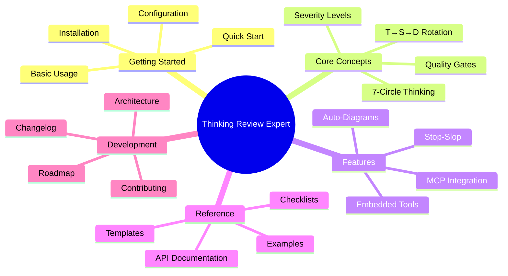
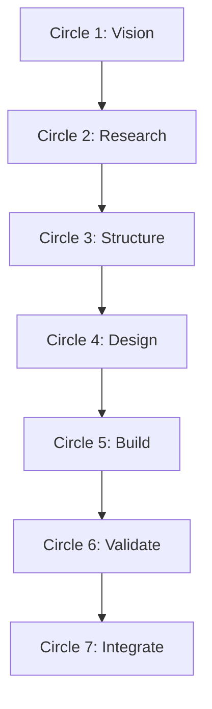
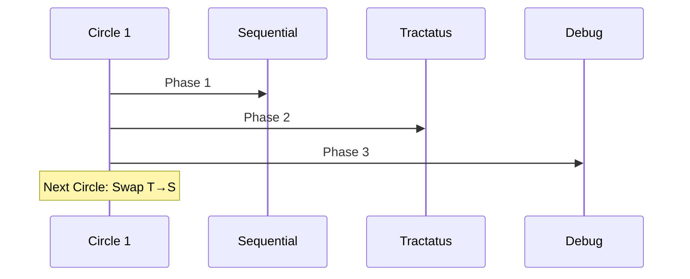
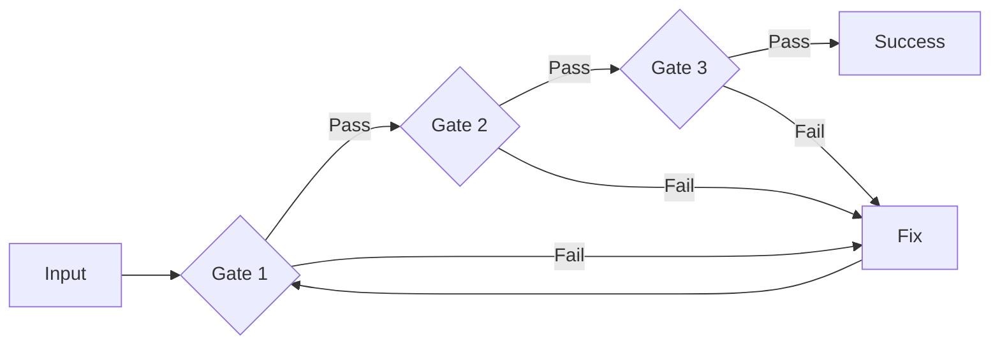
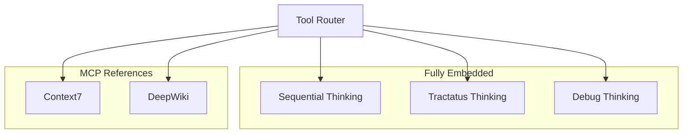
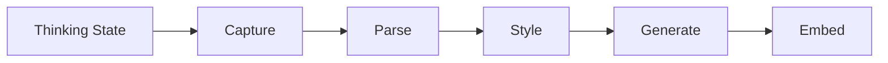
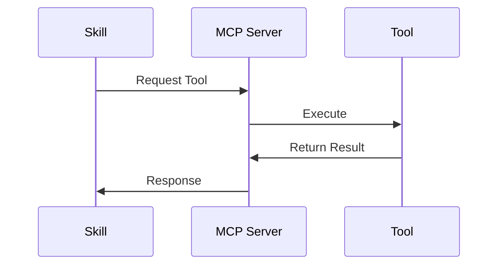
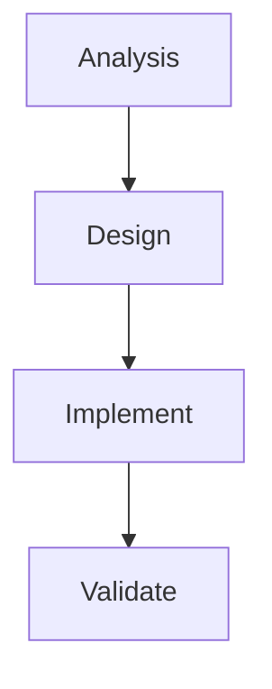

# Wiki Documentation

Welcome to the Thinking Review Expert wiki! This comprehensive documentation covers everything you need to know about the skill.

## Quick Navigation



## Table of Contents

1. [Getting Started](#getting-started)
2. [Core Concepts](#core-concepts)
3. [Features](#features)
4. [Reference](#reference)
5. [Development](#development)
6. [FAQ](#faq)

---

## Getting Started

### Installation

```bash
# Via npm
npm install -g thinking-review-expert

# Via Claude Code Skills
cd ~/.claude/skills/
git clone https://github.com/Alot1z/thinking-review-expert.git
```

### Quick Start


**Basic Usage:**

```markdown
skill: "thinking-review-expert"
Validate: my-thinking-session
```

### Configuration

No configuration required! The skill automatically:

1. Detects thinking MCP usage
2. Applies appropriate validation
3. Generates diagrams
4. Produces reports

---

## Core Concepts

### 7-Circle Sacred Thinking



**Each Circle Validates:**
- Purpose alignment
- Cognitive depth
- Logical structure
- Quality gates
- Integration points

### T→S→D Tool Rotation



**Rotation Pattern:**
- **Circles 1,3,5,7**: Sequential → Tractatus → Debug
- **Circles 2,4,6**: Tractatus → Sequential → Debug

### Quality Gates

Each circle must pass quality gates:



### Severity Levels

| Level | Name | Action |
|-------|------|--------|
| **P0** | Critical | Must fix immediately |
| **P1** | High | Should fix before proceeding |
| **P2** | Medium | Consider fixing for quality |
| **P3** | Low | Optional enhancement |

---

## Features

### Embedded Tools



**Priority:**
1. Embedded tools (fully functional)
2. MCP servers (fallback only)

### Auto-Diagram Generation

**Beautiful-Mermaid Integration:**



**15 Built-in Themes:**
- Default
- Dark
- Forest
- Neutral
- Base
- Plus 10 more

### Stop-Slop Enhancement

**Auto-applied to all outputs:**

- Direct, active language
- No buzzwords
- Specific terms
- Concise expression
- Clear communication

### MCP Integration



**Supported MCPs:**
- Context7 (documentation)
- DeepWiki (GitHub research)
- Sequential Thinking
- Tractatus Thinking
- Debug Thinking

---

## Reference

### API Documentation

#### Skill Invocation

```markdown
skill: "thinking-review-expert"
```

#### Validation Request

```markdown
Validate: {thinking-session-output}
```

#### Parameters

| Parameter | Type | Required | Description |
|-----------|------|----------|-------------|
| `session_output` | string | Yes | Thinking session to validate |
| `circles` | number | No | Number of circles (default: 7) |
| `strict_mode` | boolean | No | Enable strict validation (default: false) |

### Checklists

#### 7-Circle Checklist

Located in: `references/7circle-checklist.md`

**Validates:**
- Circle completion
- Tool rotation
- Progression logic
- Quality gates

#### Logical Structure Checklist

Located in: `references/logical-structure-checklist.md`

**Validates:**
- Atomic decomposition
- Sequential progression
- Problem-solution tracking
- Coherence

#### Depth Quality Checklist

Located in: `references/depth-quality-checklist.md`

**Validates:**
- Thought cycle count
- Cognitive depth
- Insight quality
- Analysis comprehensiveness

### Templates

#### Validation Report Template

```markdown
# Thinking Review Report

## Session Info
- Agent: {agent-id}
- Task: {description}
- Review Time: {timestamp}

## Overall Assessment
- Quality Score: {0-100}
- Status: {excellent/good/acceptable/needs-improvement}
- Recommendation: {proceed/rethink/redo}

## Severity Breakdown
- P0 (Critical): {count}
- P1 (High): {count}
- P2 (Medium): {count}
- P3 (Low): {count}
```

### Examples

#### Example 1: Sequential Thinking Review

**Input:**
```json
{
  "thinking_tool": "sequential-thinking",
  "thoughts": [
    {"number": 1, "content": "Analyze problem"},
    {"number": 2, "content": "Design solution"},
    {"number": 3, "content": "Implement"}
  ]
}
```

**Output:**
```markdown
## Circle 1 (Vision): 85/100
- Status: PASS
- Thought Cycles: 3
- Strengths: Clear progression
- Issues: P2: Could be deeper
```

#### Example 2: Auto-Generated Diagram

**Input:**
```json
{
  "thinking_state": "Analyzing system architecture..."
}
```

**Output:**


---

## Development

### Architecture

See [ARCHITECTURE.md](ARCHITECTURE.md) for:
- System architecture
- Component design
- Data flow
- Integration points

### Contributing

See [CONTRIBUTING.md](CONTRIBUTING.md) for:
- Code of conduct
- Development setup
- Pull request process
- Release process

### Changelog

See [CHANGELOG.md](CHANGELOG.md) for:
- Version history
- Feature changes
- Bug fixes
- Breaking changes

---

## FAQ

### General Questions

**Q: What does this skill do?**  
A: Automatically validates 7-circle sacred thinking flows with quality gates, auto-generated diagrams, and stop-slop enhancement.

**Q: How do I install it?**  
A: Via npm: `npm install -g thinking-review-expert` or clone to your Claude skills directory.

**Q: Does it work with all thinking tools?**  
A: Yes! Supports Sequential, Tractatus, and Debug thinking tools.

### Technical Questions

**Q: What's the token savings?**  
A: 85-90% via lazy loading and embedded tools.

**Q: Are Context7/DeepWiki embedded?**  
A: No, they're MCP references. Only the 3 thinking tools are fully embedded.

**Q: How does auto-diagram generation work?**  
A: Automatically captures thinking state and generates mermaid diagrams with beautiful-mermaid styling.

### Usage Questions

**Q: How do I trigger validation?**  
A: The skill automatically activates when thinking tools are used.

**Q: Can I customize validation rules?**  
A: Yes! Edit the checklist files in `references/`.

**Q: What's the T→S→D rotation?**  
A: Alternating tool rotation pattern: Sequential→Tractatus→Debug (swaps order each circle).

### Troubleshooting

**Q: Validation isn't triggering**  
A: Check that:
1. Skill is properly installed
2. Thinking MCP is configured
3. Session output is properly formatted

**Q: Diagrams aren't generating**  
A: Verify:
1. Beautiful-mermaid reference is loaded
2. Thinking state is properly captured
3. Mermaid syntax is correct

**Q: Poor quality scores**  
A: Review:
1. Thought cycle count (target: 8+ per circle)
2. Tool rotation pattern
3. Quality gate requirements

---

## Additional Resources

### Official Documentation

- [README.md](README.md) - User guide
- [ARCHITECTURE.md](ARCHITECTURE.md) - System architecture
- [CONTRIBUTING.md](CONTRIBUTING.md) - Contribution guide
- [CHANGELOG.md](CHANGELOG.md) - Version history

### External Resources

- [7-Circle Sacred Thinking](https://github.com/Alot1z/7-circle-bmad) - Core methodology
- [Mermaid Documentation](https://mermaid.js.org/) - Diagram syntax
- [Claude Code Documentation](https://docs.anthropic.com/) - Claude Code guide

### Community

- **GitHub Issues**: https://github.com/Alot1z/thinking-review-expert/issues
- **GitHub Discussions**: https://github.com/Alot1z/thinking-review-expert/discussions
- **Contributors**: See CONTRIBUTORS.md

---

**Wiki Version**: 6.0.0  
**Last Updated**: 2025-01-06  
**Maintainer**: Alot1z
