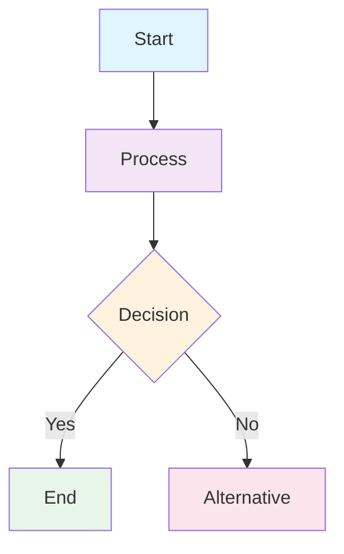

# Beautiful Mermaid Diagram Styling

**Source**: https://github.com/lukilabs/beautiful-mermaid  
**Embedded**: Complete styling guidelines  
**Purpose**: Clean, professional mermaid diagrams

---

## Color System

### Two-Tier Model

**Required:**
- `bg`: Background color
- `fg`: Foreground color

**Auto-derived (if not provided):**
- `line`: 30% fg mixed with bg
- `accent`: 50% fg mixed with bg
- `muted`: 40% fg mixed with bg
- `surface`: 3% fg mixed with bg (node fills)
- `border`: 20% fg mixed with bg (node strokes)

### Built-in Themes

**Light Themes:**
- `zinc-light` (default): bg=#FFFFFF, fg=#27272A
- `tokyo-night-light`: bg=#d5d6db, fg=#343b58
- `catppuccin-latte`: bg=#eff1f5, fg=#4c4f69
- `nord-light`: bg=#eceff4, fg=#2e3440
- `github-light`: bg=#ffffff, fg=#1f2328
- `solarized-light`: bg=#fdf6e3, fg=#657b83

**Dark Themes:**
- `zinc-dark`: bg=#18181B, fg=#FAFAFA
- `tokyo-night`: bg=#1a1b26, fg=#a9b1d6
- `catppuccin-mocha`: bg=#1e1e2e, fg=#cdd6f4
- `nord`: bg=#2e3440, fg=#d8dee9
- `dracula`: bg=#282a36, fg=#f8f8f2
- `github-dark`: bg=#0d1117, fg=#e6edf3

---

## Typography

**Fonts:**
- Default: `'Inter'`
- Monospace: `'JetBrains Mono'`, `'SF Mono'`, `'Fira Code'`

**Sizes:**
- Node labels: 13px, weight 500
- Edge labels: 11px, weight 400
- Group headers: 12px, weight 600
- Code: 11px, weight 400

---

## Spacing

**General:**
- Canvas padding: 40px
- Node padding: 16px horizontal, 10px vertical
- Node spacing: 40px

**By Diagram Type:**
- Class diagrams: 40px padding, 8px section padding
- ER diagrams: 50px node spacing, 70px layer spacing
- Sequence: 30px padding, 10px activation box width

---

## Best Practices

1. **Use themes** - Consistent `bg`/`fg` for coherence
2. **Clear labels** - Descriptive node and edge labels
3. **Consistent direction** - Maintain flow, override only when needed
4. **Subgraphs** - Organize complex diagrams
5. **Visual hierarchy** - Use accent/muted colors for emphasis

---

## Standard Template

---

## Node Shapes

**Flowcharts (12 shapes):**
1. Rectangle: `A[Label]`
2. Rounded: `A(Label)`
3. Diamond: `A{Label}`
4. Stadium: `A([Label])`
5. Circle: `A((Label))`
6. Subroutine: `A[[Label]]`
7. Double Circle: `A(((Label)))`
8. Hexagon: `A{{Label}}`
9. Cylinder: `A[(Label)]`
10. Asymmetric: `A>Label]`
11. Trapezoid: `A[/Label\]`
12. Inverse: `A[\Label/]`

**Edge Styles:**
- Solid: `-->`
- Dotted: `-.->`
- Thick: `===`
- Bidirectional: `<-->`
- Labeled: `-->|label|`

---

**Embedded From**: beautiful-mermaid  
**Version**: Latest  
**License**: MIT
