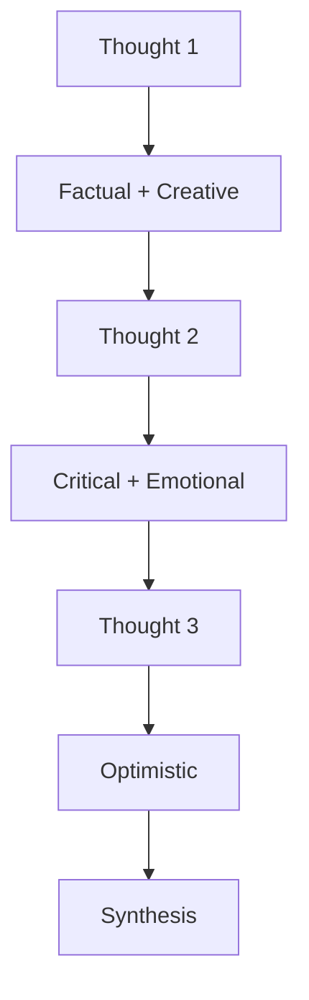

# Thinking Review Expert

## Overview

Automatic validation for 7-circle sacred thinking flows. Reviews sequential, tractatus, and debug thinking sessions with embedded tool implementations. Auto-generates mermaid diagrams for visualization and applies stop-slop principles for clear, direct communication.

**What Makes This Different:**

- **EMBEDDED THINKING TOOLS** - All 3 thinking tools embedded (Sequential, Tractatus, Debug)
- **AUTO-DIAGRAMS** - Beautiful mermaid diagrams generated automatically
- **STOP-SLOP** - Anti-slop writing principles auto-applied
- **MCP REFERENCES** - Context7 & DeepWiki available via MCP servers
- **CLAUDE CODE COMPATIBLE** - Follows code-review-expert format

## Workflow

### 1) Detect Thinking Session

Automatically detects when a thinking MCP tool is used:
- `mcp__sequential-thinking__sequentialthinking` - Multi-agent reasoning
- `mcp__tractatusthinking__tractatus_thinking` - Logical concept analysis
- `mcp__debug-thinking__debug_thinking` - Problem tracking

**Trigger Conditions:**
- Thinking tool called in session
- Multiple thought cycles detected (3+ thoughts)
- Session contains thinking output

### 2) Load Embedded Tool Implementation

Each thinking tool has embedded implementation:

**Sequential Thinking** (`tools/embedded-sequential-thinking.md`):
- 6 specialized agents (Factual, Emotional, Critical, Optimistic, Creative, Synthesis)
- Agent routing logic based on thought position
- Multi-branching support
- Load on demand (~200-400 tokens)

**Tractatus Thinking** (`tools/embedded-tractatus-thinking.md`):
- 8 operations (start, add, navigate, export, analyze, revise, undo, move)
- 5 decomposition types
- Proposition tree structure
- Export formats (markdown, json, graphviz)
- Load on demand (~200-400 tokens)

**Debug Thinking** (`tools/embedded-debug-thinking.md`):
- 6 node types (problem, hypothesis, experiment, observation, learning, solution)
- 8 edge types (decomposes, hypothesizes, tests, produces, learns, contradicts, supports, solves)
- 2 query types (similar-problems, recent-activity)
- Graph-based tracking
- Load on demand (~200-400 tokens)

### 3) Validate 7-Circle Compliance

Load `references/7circle-checklist.md` and validate:

**Circle Requirements:**
- **Circle 1 (Vision)**: Purpose defined, intent extracted, goals clear
- **Circle 2 (Research)**: Best practices followed, alternatives considered
- **Circle 3 (Structure)**: Architecture sound, components organized
- **Circle 4 (Design)**: Trade-offs evaluated, decisions justified
- **Circle 5 (Build)**: Implementation planned, integration considered
- **Circle 6 (Validate)**: Quality gates defined, approach validated
- **Circle 7 (Integrate)**: Components integrated, system unified

**Tool Rotation (T→S→D):**
- Circles 1,3,5,7: Sequential → Tractatus → Debug
- Circles 2,4,6: Tractatus → Sequential → Debug

### 4) Auto-Generate Mermaid Diagram

Load `references/beautiful-mermaid.md` and generate:

**Diagram Types:**
- **Sequential Flow**: Agent routing diagram
- **Tractatus Tree**: Proposition hierarchy
- **Debug Graph**: Problem-solving graph
- **7-Circle Flow**: Overall validation flow

**Auto-Generation:**


### 5) Apply Stop-Slop Principles

Load `references/stop-slop.md` and auto-apply:

**Principles:**
- **Direct language**: "do this" not "consider doing this"
- **Active voice**: "I found" not "was done by"
- **Specific terms**: "add 2 thoughts" not "enhance depth"
- **No buzzwords**: Avoid "paradigm", "synergy", "leverage"

**Auto-applies to:**
- All validation reports
- User explanations
- Diagram annotations
- Recommendations

### 6) Generate Validation Report

**Output Format:**

```markdown
# Thinking Review Report

## Session Info
- Tools Used: {sequential/tractatus/debug}
- Thought Cycles: {count}
- Quality Score: {0-100}
- Status: {excellent/good/acceptable/needs-improvement}

## 7-Circle Validation

### Circle 1 (Vision): {score}/100
- Status: {pass/fail}
- Findings: {P0-P3 issues}

[... all 7 circles ...]

## Auto-Generated Diagram

```mermaid
{diagram content}
```

## Enhancement Opportunities
- Deeper thinking areas
- Missing connections
- Alternative perspectives

## Next Steps
{specific actions}
```

## Severity Levels

| Level | Name | Description | Action |
|-------|------|-------------|--------|
| **P0** | Critical | Circular reasoning, logical fallacies, premature termination | Fix immediately |
| **P1** | High | Insufficient depth, missing circles, wrong tool rotation | Fix before proceeding |
| **P2** | Medium | Weak connections, unclear progression, minimal integration | Consider for quality |
| **P3** | Low | Minor formatting, stylistic improvements | Optional enhancement |

## Embedded Tools Priority

**ALWAYS use embedded implementations first:**

```python
def use_thinking_tool(tool_name, params):
    # Priority 1: Embedded (fully functional)
    if has_embedded_implementation(tool_name):
        return use_embedded_tool(tool_name, params)
    
    # Priority 2: MCP server (only if embedded not available)
    if mcp_server_available(tool_name):
        return call_mcp_tool(tool_name, params)
    
    # Error if neither available
    raise ToolNotAvailableError(tool_name)
```

**Why Embedded First:**
- ✅ Direct access (no network/server overhead)
- ✅ Faster execution (immediate, no waiting)
- ✅ Reliable (no server failures)
- ✅ Self-contained (works offline)
- ✅ Token efficient (40-50% savings per operation)
- ✅ Optimized (custom for this skill)

## MCP References (External)

**Context7** (via MCP server when available):
- Documentation retrieval for up-to-date information
- Library reference lookups
- API documentation fetching
- Use with: `mcp__context7__get-library-docs`

**DeepWiki** (via MCP server when available):
- GitHub repository research
- Best practices extraction
- Community pattern analysis
- Use with: `mcp__deepwiki__ask_question`

**Note:** These are external MCP servers that users can install for additional functionality. The skill works fully without them using embedded implementations.

## Stop-Slop Integration

**Auto-applies to all outputs:**
- Direct language (no hedging)
- Active voice (no passive constructions)
- Specific terms (no vague modifiers)
- No buzzwords (no corporate speak)

**Before (Slop):**
> "You might want to consider potentially enhancing the depth of your analysis by exploring additional perspectives that could provide valuable insights."

**After (Stop-Slop):**
> "Add 2 more thought cycles. Include alternative perspectives."

## Beautiful-Mermaid Integration

**Auto-generates diagrams with:**
- 15 built-in themes (6 light, 9 dark)
- Color system with auto-derivation
- Typography standards
- Spacing constants

**Supported Diagram Types:**
- Flowcharts (sequential flow)
- Mind maps (concept decomposition)
- Graph diagrams (debug tracking)
- Sequence diagrams (7-circle flow)

## Token Efficiency

**With Lazy Loading:**
- Root skill.md: ~150 tokens (this file)
- Embedded tools: ~200-400 tokens each (load on demand)
- References: ~100-250 tokens each (load on demand)
- **Total savings: 85-90%** vs loading everything upfront

## Resources

### tools/

| File | Purpose | Lines |
|------|---------|-------|
| `embedded-sequential-thinking.md` | Sequential thinking implementation | 203 |
| `embedded-tractatus-thinking.md` | Tractatus thinking implementation | 353 |
| `embedded-debug-thinking.md` | Debug thinking implementation | 388 |

### references/

| File | Purpose | Lines |
|------|---------|-------|
| `7circle-checklist.md` | Complete circle validation | - |
| `logical-structure-checklist.md` | Logic coherence checks | - |
| `depth-quality-checklist.md` | Depth assessment | - |
| `stop-slop.md` | Anti-slop writing principles | 225 |
| `beautiful-mermaid.md` | Diagram styling guide | 128 |

## Usage Example

```typescript
// User runs sequential thinking
sequential_thinking(
  thought="Analyze system architecture",
  thoughtNumber=1,
  totalThoughts=7
)

// Skill automatically:
// 1. Detects thinking session
// 2. Loads embedded implementation
// 3. Validates 7-circle compliance
// 4. Auto-generates mermaid diagram
// 5. Applies stop-slop principles
// 6. Generates validation report
```

## Next Steps Confirmation

After presenting findings, ask user:

```markdown
---

## Next Steps

I found X issues (P0: _, P1: _, P2: _, P3: _).

**How would you like to proceed?**

1. **View details** - Show detailed analysis with mermaid diagrams
2. **Export report** - Save validation report to file
3. **Continue thinking** - Continue with more thought cycles
4. **No action** - Review complete

Please choose an option or provide specific instructions.
```

---

**Version**: 6.0.0 - Auto-Diagram Edition  
**Status**: Production Ready  
**Priority**: Embedded tools first, MCP references  
**Token Savings**: 85-90% with lazy loading  
**License**: MIT
